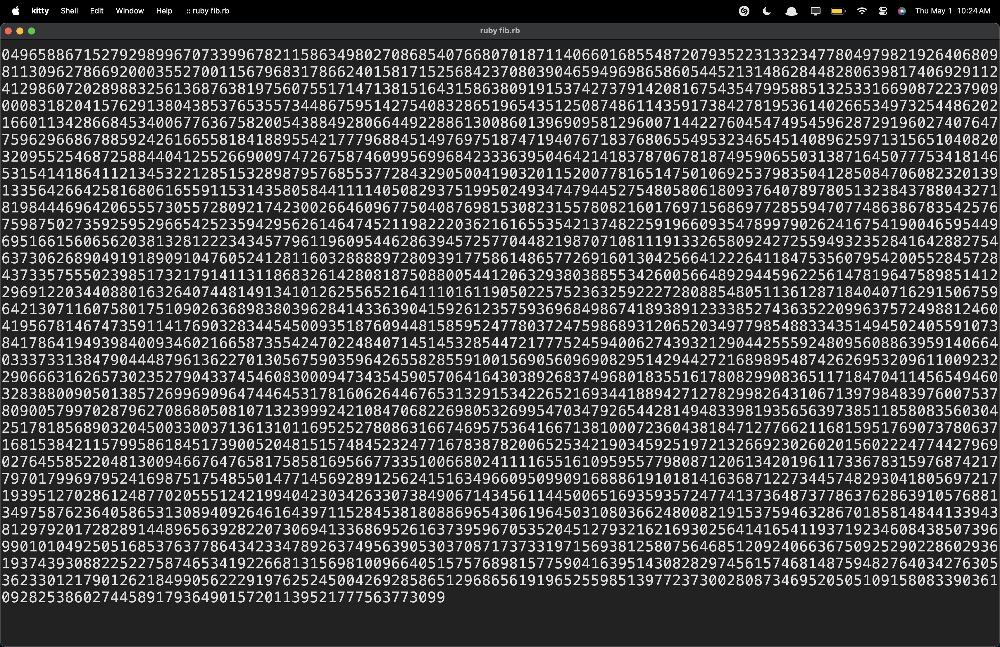

<div align="center">

# fib
## A Fibonacci calculator writin in multipule languages to see what out-preforms what.

<a href="/COPYRIGHT">Copyright</a>
</div>


######

This is the `ruby` script (The best preforming one). Feel free to improve any of these or just experiment.

There are 2 different types of scripts in this repo, `fib-op` & `fib`

Im also working on youtube video where I compare all of the languages in this repo in the <b>Grand Coding Language Olympics</b>

#

### Tutorial.rs
Go into the `tutorial.rs` file and change any of the functions to `0` to run them.
```
docker build -t fib-dock-tut ./Tutorial
docker run fib-dock-tut
```

### How to use

#### Ruby
```
docker pull rokyh/fib-dock
docker run rokyh/fib-dock
```

Or compile the image yourself. Run the following in your terminal:
```
docker build -t fib-dock ./
docker run fib-dock
```

This will make a `docker` container and run the script `fib-op.rb`

#### C
Compile from source:
```
docker build -t fib-dock-c ./C-Docker
docker run fib-dock-c
```

#### JS
```
docker build -t fib-dock-js ./JS-Docker
docker run fib-dock-js
```

#### PHP
```
docker build -t fib-dock-php ./PHP-Docker
docker run fib-dock-php
```

#### Rust
```
docker build -t fib-dock-rust ./RUST-Docker
docker run fib-dock-rust
```

### Credits
Max Hendra

##### <a href="https://war.ukraine.ua/support-ukraine/">Support Ukraine! 🇺🇦</a>