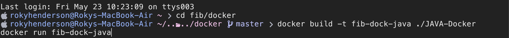

# Lets get started - The beginning of fib

Dependencies:
 - A Working internet connection
 - Docker
 - Docker (Daemon) Running
 - A functional shell - bash/zsh

To start chose one of the many coding languages that we provide.

Now that you have chosen you can run a  <a href="http://www.docker.com">Docker</a>

A `Docker` Container is a small virtual machine of `Linux` where all your dependencies are installed. EG if you chose `ruby` it would install `ruby`'s interpretier and then run it.
<a href="../Docker/RUBY-Docker/Dockerfile"> If you are curious here is the ruby `Dockerfile`</a>

Now inside of `fib/docker` run one of the commands from the <a href="../.github/README.md">README</a>

boom after a bit you should have a working task of `fib` running on your computer.

<a href="./2.md">Next --></a>
